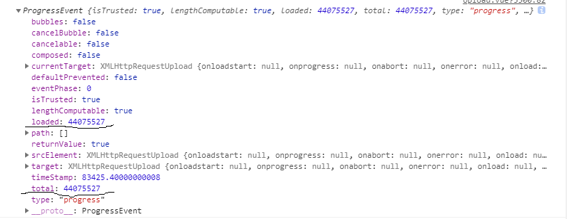

# 下载进度条
上传文件等待很久的情况下，需要有一个进度条来了解当前上传情况<br>
之前纠结很久没找到解决方法，读了一下axios文档，恍然大悟。原来ajax提供了
原生的下载和上传进度事件,当然axios封装之后变得更加简单好用了
## 实现
``` javascript
// axios 的配置文件
{
  // `onUploadProgress` 允许为上传处理进度事件
  onUploadProgress: function (progressEvent) {
    // 对原生进度事件的处理
  },
  // `onDownloadProgress` 允许为下载处理进度事件
  onDownloadProgress: function (progressEvent) {
    // 对原生进度事件的处理
  }

  // 假如请求如下  http是axios的一个实例
  download = (data,callback) =>http.post('url..',data, {
    //..里面写配置}
    onUploadProgress:(e) =>{
      // 用回调函数将 e 处理并且传递出去
      callback(e)
  })
}
```
放一张关于e内容的图片 chrome70版本下的<br>
